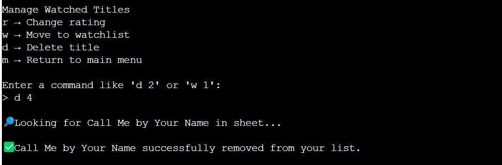

# ReelTracker CLI

## Table of Contents

- [Summary](#summary)
- [Project Goals](#project-goals)
- [User Goals](#user-goals)
- [User Stories](#user-stories)
  - [Must Have (MVP)](#must-have-mvp)
  - [Should Have](#should-have)
  - [Could Have](#could-have)
- [Backlog](#backlog)
- [Features](#features)
  - [Core Functionality](#core-functionality)
  - [Data Storage & Sync](#data-storage--sync)
  - [Smart Sorting & Discovery](#smart-sorting--discovery)
  - [Error Handling](#error-handling)
  - [Interface & Code Design](#interface--code-design)
- [Requirements](#requirements)
- [Run Locally](#run-locally)
- [Deploy to Heroku](#deploy-to-heroku)
- [Testing](#testing)
- [References](#references)

## Summary

In today's streaming landscape, users face information overload with thousands of movies and TV shows spread across multiple platforms like Netflix, Disney+, etc. Many struggle to keep track of what they want to watch, often relying on messy notes, memory, or scattered lists across different apps. A [recent survey](https://nypost.com/2024/12/19/lifestyle/why-its-so-hard-to-find-something-to-watch-lately/) revealed that people spend an average of 110 hours a year just searching for content, while 51% feel overwhelmed by excessive recommendations. Additionally, growing [privacy concerns](https://www.thetimes.com/uk/technology-uk/article/how-to-stop-smart-tv-spying-on-you-pzfxx7mr8) around smart TVs and streaming services highlight the need for user-controlled, non-intrusive tracking tools.

Reel Tracker CLI is a lightweight, command-line-based personal watchlist manager designed for movie lovers, binge-watchers, film critics, and streaming enthusiasts. It helps users save and organize their watchlists, track watched content, and provide ratings and recommendations—all without intrusive data collection or algorithmic manipulation. By offering a privacy-focused, efficient, and customizable alternative to mainstream tracking apps, Reel Tracker CLI appeals to tech-savvy, data-conscious users who prefer self-managed solutions. The project also has potential for future expansion, including a front-end interface, user authentication, and database integration, making it valuable for market researchers and content licensing professionals as well.

More details at [#1](https://github.com/larevolucia/reeltracker_cli/issues/1)

Deployed at [Heroku](https://reeltrackercli-ff0190b86239.herokuapp.com/)

Titles Data available for read at [Google Sheets](https://docs.google.com/spreadsheets/d/1t0eogZL-QBFHBdLL0oipMXqyZ8MA3sZ8TJJPvrBvdYk/edit?usp=sharing)

## Project Goals
1. Address Information Overload in Entertainment
2. Develop a Personal Watchlist Tracker
3. Cater to Target Users with a CLI-Based Solution
4. Focus on Privacy and User-Controlled Data
5. Build a Scalable and Expandable Tool

## User Goals
1. Effortless Watchlist Management
2. Track Viewing History Easily
3. Make Better Viewing Choices
4. Stay in Control of Their Data & Privacy
5. Optimize Their Viewing Experience Across Multiple Platforms

## User Stories

### Must Have (MVP)
- [As a user, I want to search for a title so that I can find relevant information.](https://github.com/larevolucia/reeltracker_cli/issues/3)
- [As a user, I want to add a title to my Watchlist or Viewing History so that I can track what I plan to watch or have already watched.](https://github.com/larevolucia/reeltracker_cli/issues/4)
- [As a user, I want to view my Watchlist or Viewing History so that I can review the titles I saved or watched.](https://github.com/larevolucia/reeltracker_cli/issues/5)
- [As a user, I want to remove a title from my Watchlist or Viewing History so that my lists remain accurate and updated.](https://github.com/larevolucia/reeltracker_cli/issues/6)
- [As a user, I want to move title between different lists (e.g. from Watchlist to Viewing History), so that I can maintain accurate tracking of my viewing progress.](https://github.com/larevolucia/reeltracker_cli/issues/7)
- [As a user, I want to exit the app when I’m done so that I can close the session properly.](https://github.com/larevolucia/reeltracker_cli/issues/8)

### Should Have
- [As a user, I want to update details of an item in my Viewing History so that I can maintain accurate records.](https://github.com/larevolucia/reeltracker_cli/issues/14)
- [As a user, I want to rate a watched title so that I can track how much I enjoyed it.](https://github.com/larevolucia/reeltracker_cli/issues/9)

### Could Have
- [As a user, I want to see trending/popular titles so that I can explore new content.](https://github.com/larevolucia/reeltracker_cli/issues/10)
- [As a user, I want to get recommendations based on my ratings so that I can discover similar movies.](https://github.com/larevolucia/reeltracker_cli/issues/11)
- [As a user, I want to receive random movie suggestions so that I can easily pick what to watch next.](https://github.com/larevolucia/reeltracker_cli/issues/12) _(Not implemented – see backlog)_
- [As a user, I want to categorize my watchlist into sublists (e.g. “Must Watch”, “For Later”) so that I can organize my movies better.](https://github.com/larevolucia/reeltracker_cli/issues/13) _(Not implemented – see backlog)_

## Backlog

The following features were *originally planned* but were not implemented in this phase due to a shift in priorities. Instead, we focused on *enhancing the user experience* by:

- Introducing [See title details](https://github.com/larevolucia/reeltracker_cli/issues/16)
- Handling [recommendations edge cases](https://github.com/larevolucia/reeltracker_cli/issues/11):
  - [No title rated 3+]
  - [List have only few items]
  - [Tie on preferred genre by frequency]
  - [No item in list matched preferred genre]

### Features Not Implemented:

#### Categorize your watchlist
- [As a user, I want to categorize my watchlist into sublists (e.g. “Must Watch”, “For Later”) so that I can organize my movies better.](https://github.com/larevolucia/reeltracker_cli/issues/13)
  _This feature was *deprioritized* in favor of [See title details](https://github.com/larevolucia/reeltracker_cli/issues/16), which provide more information for user about the titles._

#### Random Movie Suggestion
- [As a user, I want to receive random movie suggestions so that I can easily pick what to watch next.](https://github.com/larevolucia/reeltracker_cli/issues/12) 
  _This feature was *deprioritized* in favor of [recommendations edge cases](https://github.com/larevolucia/reeltracker_cli/issues/11), which ensures coherent feedback to user and better recommendations._

## Features

### 🎯 Core Functionality

#### User Flow Overview
The diagram below illustrates how users interact with the core features of the ReelTracker CLI.


#### Search titles via TMDb API

Users can search for movies or TV shows by keyword. The app returns results from The Movie Database (TMDb) API, including title, type, release year, and a short overview.
Related user story:  [#3 Search for a title](https://github.com/larevolucia/reeltracker_cli/issues/3)


#### Add to watchlist
Users can add any title from the search results directly to their personal watchlist for future viewing.
Related user story:  [#4 Add to watchlist or Viewing History](https://github.com/larevolucia/reeltracker_cli/issues/4)


#### Mark titles as watched and assign ratings
Users can mark a title as watched and give it a personal rating from 1 to 5. This allows them to track both progress and preferences.
Related user story:  [#5 View lists](https://github.com/larevolucia/reeltracker_cli/issues/5), [#9 Rate watched title](https://github.com/larevolucia/reeltracker_cli/issues/9), [#14 Update title](https://github.com/larevolucia/reeltracker_cli/issues/14)


####  Move titles between lists
A title can be moved from the Watchlist to the Viewing History once watched, preserving metadata such as date added.
When moving a title from Viewing History to Watchlist, watched data and rating are reset. 
Related user story:  [#7 Move title between lists](https://github.com/larevolucia/reeltracker_cli/issues/7), [#14 Update title](https://github.com/larevolucia/reeltracker_cli/issues/14)


#### Delete title from lists
Users can delete a title from the lists.
Related user story:  [#6 Remove a title from lists](https://github.com/larevolucia/reeltracker_cli/issues/6)



#### Title recommendations
The system analyzes genre patterns from previously watched content, identifies top-rated titles (ratings ≥ 3), and sorts the watchlist based on genre similarity and media type preference. This allows users to receive tailored suggestions that reflect their actual taste and not generic trends or ads.
Related user stories:[#9 Rate watched title](https://github.com/larevolucia/reeltracker_cli/issues/9), [#11 Get recommendations](https://github.com/larevolucia/reeltracker_cli/issues/11)

##### See what's trending
Allows users to explore trending titles based on real-time popularity data from The Movie Database (TMDb). This feature is especially useful when users are just getting started or looking for something new outside of their personal watchlist. 
Trending titles are also shown when for recommendation flows where the user has no titles in their watchlist or viewing history.
Related user story:[#10 See what's trending](https://github.com/larevolucia/reeltracker_cli/issues/10)

### 📁 Data Storage & Sync

#### Google Sheets integration 
All user data (watchlist, history, ratings) is stored in a personal Google Sheet via the Sheets API. This ensures cloud persistence and makes data accessible outside the CLI.
- Uses `gspread` and `google-auth` for integration
- Credentials are safely loaded from a `.json` file and hidden using `.gitignore`

#### Reload and reconstruct data
The app can rebuild `Title` objects from the spreadsheet using the `from_sheet_row()` method. This ensures data continuity across sessions.

### 📈 Smart Sorting & Discovery

#### Weighted popularity sorting

A custom `calculate_weighted_popularity()` function ensures titles are ranked based on both `TMDb popularity` and `vote count`. This prevents obscure titles with low votes from unfairly topping the list. Search output uses this function to display most relevant item on top with the use of `sort_items_by_popularity`.

Consulted references:
- [Python Math](https://docs.python.org/3/library/math.html)
- [W3School sorted( )](https://www.w3schools.com/python/ref_func_sorted.asp)
- [FreeCodeCamp lambda sort list in Python](https://www.freecodecamp.org/news/lambda-sort-list-in-python/)

#### Recommmendation workflow
1. **Analyze viewing history** 
The system identifies titles rated 3 or higher in the watched list using `get_top_rated_titles()`. 
It then determines a preferred genre using rating-weighted frequency via `get_preferred_genre()`

2. **Sort the watchlist** 
If watchlist titles exist:

- It attempts to filter by the preferred genre using `filter_list_by_genre()`.
- If genre matches are found, titles are ranked by genre similarity to a top-rated title and popularity using `sort_titles_by_relevance()`.
- Titles are then reordered to prioritize the user’s preferred media type (movie or TV) via `reorder_titles_by_media_type()`

3. **Show personalized list**
The resulting sorted list is displayed to the user for selection via `display_title_entries()` and `display_and_select_title()`

4. **Handle edge cases**
When recommendations cannot be generated due to lack of data, the system will:
- No top-rated titles: Calls `handle_no_top_rated()`, which analyzes all titles (watched + watchlist) and uses TMDb’s discovery API based on inferred media type and genre.
- Very few items (≤3): A warning is printed indicating limited recommendation accuracy.
- Tied genre frequency: The `get_preferred_genre()` function uses rating totals as a tiebreaker.
- No genre matches in watchlist: Falls back to sorting entire watchlist by genre similarity and popularity, skipping genre filtering.


### 🛡️ Error Handling 

#### Input validation

- Invalid menu options prompt the user to try again (`get_menu_choice`)
- Malformed commands (like `w x`) return a helpful message explaining the issue (`handle_action_with_index`)
- Ratings must be numeric and between 1–10; otherwise, the user is re-prompted (`get_title_rating`)
- Empty search queries are rejected with clear prompts (`get_user_search_input`)

#### Index and Selection Handling

When selecting items from a list:

- Out-of-range indexes (e.g. choosing item 10 in a list of 3) are caught and explained (`select_item_from_results`)
- Non-numeric selections result in a descriptive error, and the user is given a chance to try again

#### External API & Sheets Failures

- TMDb API requests (e.g. `fetch_tmdb_results`) handle network timeouts, invalid responses, and missing keys with user-friendly messages.
- Google Sheets operations check for missing worksheets and initialize them as needed (`save_item_to_list`, `get_titles_by_watch_status`).
- If the Google Sheet is missing or the `creds.json` is misconfigured, the app will not crash but instead show a clear error and exit gracefully.

#### Graceful Recovery

Whenever possible, users will be given the option to retry or return to a safe state (e.g. re-search, go back to the main menu) rather than exiting abruptly.

### 🧰 Interface & Code Design

#### Clean and readable terminal output
The UI adapts to Heroku CLI constraints (80x24), avoiding broken formatting and wrapping issues. Multi-line outputs (like overviews) are carefully indented for clarity.

#### Modular code architecture 
The codebase is structured in modules by responsibility. This improves readability, scalability, and maintainability.

```bash
.
├── run.py                      # Entry point for the CLI application
├── requirements.txt            # Python package dependencies
├── .gitignore                  # Specifies files and directories to be ignored by Git
├── .env                        # Environment variables: TMDB API key, TMBD URL (ignored in Git)
├── creds.json                  # Google Sheets API credentials (ignored in Git)
├── README.md                   # Project overview and setup instructions

├── models/                     # Core application data classes and logic
│   ├── __init__.py             
│   ├── title.py                # Represents a media title with metadata and user-specific logic
│   ├── user_data.py            # Manages user-generated data like watch history and ratings
│   └── title_metadata.py       # Defines the TitleMetadata dataclass for detailed metadata

├── recommendations/            # Title recommendation system
│   ├── __init__.py
│   ├── display.py              # Displays recommendations in the UI
│   ├── filters.py              # Functions for filtering titles
│   ├── gemre_analysis.py       # Genre preference and similarity
│   ├── handlers.py             # Handles recommendation logic (user actions, data routing)
│   ├── recommendations.py      # Generates and manages recommendations
│   ├── smart_recs.py           # Logic for personalized recommendations
│   ├── trending.py             # Handles fetching and displaying trending titles for recommendations
│   └── utils.py                # Helper functions for sorting recommended titles

├── sheets/                     # Google Sheets integration
│   ├── __init__.py
│   ├── auth.py                 # Handles authentication and sheet connection setup
│   ├── crud.py                 # Performs create, update, and delete operations on sheet rows
│   ├── query.py                # Retrieves and filters rows, checks for duplicates
│   └── utils.py                # Converts raw sheet data into Title objects

├── tmdb/                       # TMDb API integration for fetching movie data
│   ├── __init__.py              
│   ├── tmdb.py                 # Contains functions for interacting with the TMDb API 
│   └── utils.py                # Processes and prepares TMDB API data

├── ui/                         # CLI display components and handlers
│   ├── __init__.py
│   ├── handlers.py             # Responds to user menu selections and triggers logic
│   ├── display.py              # Handles layout and terminal content display
│   ├── menus.py                # CLI menus and navigation
│   └── user_input.py           # Captures and validates user input

├── utils/                      # General-purpose utilities
│   ├── __init__.py              
│   └── utils.py                # Utitlity functions such as formatting and sorting

├── documentation/              # Contains project documentation and visual assets
│   ├── search_1.png            # Screenshot demonstrating search functionality
│   ├── watched_1.png           # Screenshot demonstrating watched list feature
│   └── ...                     # Additional documentation files and assets
```

#### Classes Overview
`Title`
Represents a movie or TV title. Holds attributes like name, type, release date, overview, popularity, vote count.
Includes methods for:
- `to_sheet_row`: formats the title data for saving to Google Sheets
- `from_sheets_row`: reconstructs a `Title` object from saved sheet data

`TitleMetadata`
Stores static metadata about a title:
- `id (str)`: Unique identifier for the title (usually from TMDb)
- `title (str)`: Human-readable title of the media
- `media_type (str)`: Type of media ('movie' or 'tv')
- `release_date (str)`: Year of release
- `genres (List[str])`: List of genre names associated with the title
- `popularity (float)`: Weighted popularity score for sorting or ranking
- `overview (str)`: Description or synopsis of the title

`UserTitleData`
Stores user-generated data about a title:
- `watched` status: edited using the `toggle_watched` method
- Personal `rating`: edited using the `set_rating` method
- `added_date` log: populated with timestamp when object creation
- `watched_date` log: populated with timestamp when `watched` status is changed to `True`

Consulted references:
- [PyNative](https://pynative.com/python-class-method-vs-static-method-vs-instance-method)
- [BuiltIn](https://builtin.com/software-engineering-perspectives/python-cls)
- [GeeksForGeeks](https://www.geeksforgeeks.org/classmethod-in-python/)
- [`__new__()` method in Python](https://medium.com/@vinayakgupta3112/new-method-in-python-the-constructor-method-you-might-not-be-aware-of-72f72561afe4)
- [How to use data classes](https://www.dataquest.io/blog/how-to-use-python-data-classes/)

## Requirements

### Python  

- Script was coded using Python version 3.12.8
- To install dependencies run `pip3 freeze > requirements.txt`

###  Google Sheets & TMDb API

To properly use the app, you’ll need:

- A Google Sheets document to store your watchlist and history.
- A Service Account JSON file for API access (creds.json)
- A TMDb API key in a `.env` file.

Follow the setup instructions on the following section to:

- Enable Google APIs and generate `creds.json`
- Create a `.env` file with your TMDb API Key 

Your project structure should look something like this:

```bash
.
├── **creds.json**
├── **.env**
├── run.py
├── ...
```

## Run Locally 

To use ReelTracker CLI on your machine, you can clone it and run it locally following the below steps.

### 1. Clone the Repository

First, open your terminal and clone the repo to your local environment:
```bash
git clone https://github.com/larevolucia/reeltracker_cli.git
cd reeltracker_cli
```

Verify the Python version you have installed is compatible. You can verify this with:

```bash
python3 --version
```

### 2. Set Up Your Virtual Environment (optional)

Create and activate a virtual environment to manage dependencies:

```bash
python3 -m venv venv
source venv\Scripts\activate # Windows
source venv/bin/activate   # macOS/Linux
```
### 3. Install Required Dependencies

```bash
pip install -r requirements.txt
```

### 4. Set up Google API

This project uses Google Sheets to store personal viewing history and watchlist. You'll need to enable Drive and Google Sheets API on your Google Cloud to be able to configure your personal list.

#### I. Creating a project

- Start by navigating to [Google Cloud Console](https://console.cloud.google.com/). If you don't have a Google account, you'll need to create one.
- Create a new project. [Check the official documentation on new project creation](https://developers.google.com/workspace/guides/create-project).

#### II. Enable APIs
- Go to your project home and navigate to _APIs and Services > Library_.
- Search for Google Drive API, navigate to its page and click on **Enable**.
- Follow the same process to activate Google Sheets API.

#### III. Get Credentials
- In your project view, navigate to _APIs and Services > Credentials_.
- Click on **Create credentials** button, select **Help me choose**.
- On the form, select **Google Drive API** on the dropdownlist os APIs.
- Select **App Data** regarding the type of data to be used.
- Fill in the name of the service account and the account ID (_You'll need this to configure your script_).
- Click and **Create and Continue**. 

####  IV. Save credentials information
- You'll be redirect to a credential screen. Select the e-mail address under **Service Account** and click on the edit button.
- Navigate to Keys and go to _Add Key > Create New Key_
- Select JSON and create.
- This action will automatically trigger a download of the json file.

#### V. Project configuration
- Move the downloaded file to the root folder of your project. You can name it **creds.json** as I did, or give it another name. Just be sure that the name is matching in your `run.py` file.
- On your Google account, create a new Google Sheets document. You can name it `reeltracker_cli` as I did, or give it another unique name. Just be sure that the name is matching in your `run.py` file.
- On your new file, click on the share button and copy&paste the e-mail address that can be found in your creds.json.
- If you haven't yet, install `gspread` and `google-auth` libraries.
- Add the following code to your project to set up your Google API connection:

    ```python
    import gspread
    from google.oauth2.service_account import Credentials

    SCOPE = [
    "https://www.googleapis.com/auth/spreadsheets",
    "https://www.googleapis.com/auth/drive.file",
    "https://www.googleapis.com/auth/drive"
    ]

    CREDS = Credentials.from_service_account_file('<your_creds_file_name>.json')
    SCOPED_CREDS = CREDS.with_scopes(SCOPE)
    GSPREAD_CLIENT = gspread.authorize(SCOPED_CREDS)
    SHEET =  GSPREAD_CLIENT.open('<your_google_sheet_name>')
    ```

### 5. Set up TMDB API

This project uses TMDB API to fetch data of movies and TV Shows. You'll need to create an account and request an API Key.

#### I. Requesting the API Key

- Go to [TMDB Signup](https://www.themoviedb.org/signup)
- Once signed in, request an API key at [TMDB API page](https://www.themoviedb.org/settings/api).

#### II. Project Configuration
-  If you haven't yet, install `requests` and `python-dotenv` libraries.
- Create a .env file on your root folder and add your API key `TMDB_API_KEY=your_actual_tmdb_api_key_here`.
- Optionally, you can also add the TMDB API URL `TMDB_URL ='https://api.themoviedb.org/3'`
- Add .env to your .gitignore file to ensure it's never pushed to GitHub.
- Load API Key from .env file:

    ```python
    import os
    from dotenv import load_dotenv

    # Load environment variables from .env file
    load_dotenv()

    # Access TMDB API key
    TMDB_API_KEY = os.getenv('TMDB_API_KEY')
    TMDB_URL = os.getenv('TMDB_URL') # if stored in .env otherwise TMDB_URL ='https://api.themoviedb.org/3'

    if TMDB_API_KEY is None:
       raise ValueError("TMDB_API_KEY not found. Check your .env file.")
    ```

#### III. Test API Request
- Test your configuration by sending an API request:
    ```python
    TMDB_URL = os.getenv('TMDB_URL')
    LANGUAGE ='language=en-US'
    TMDB_API_KEY = os.getenv('TMDB_API_KEY')

    url = f'{TMDB_URL}/movie/popular?api_key={TMDB_API_KEY}&{LANGUAGE}&page=1'
    response = requests.get(url,timeout=10)
    if response.status_code == 200:
        data = response.json()
        return data['results']
    else:
        print(f"Error: {response.status_code}, {response.text}")
        return []

    ```
- You can install `rich` library for an easier read of the json response
    ```python
    import json
    from rich import print_json

    url = f'{TMDB_URL}/movie/popular?api_key={api_key}&{LANGUAGE}&page=1'
    response = requests.get(url,timeout=10)
    if response.status_code == 200:
        data = response.json()
        return data['results']
    ```


### 6. Run the application

Once everything is configured, run the CLI tool:

```bash
python run.py
```

If everything is set up correctly, you should see the ReelTracker menu in your terminal.

## Deploy to Heroku

### Creating the Heroku app

When you create the app, you will need to add two buildpacks from the _Settings_ tab. The ordering is as follows:

1. `heroku/python`
2. `heroku/nodejs`

### Config Var
- You must then create a _Config Var_ called `PORT`. Set this to `8000`
- You must then create a _Config Var_ called `CREDS`. Copy&Paste your `creds.json` file contents.
- You must then create a _Config Var_ called `TMDB_API_KEY`. Copy&Paste your API Key value.

Connect your GitHub repository and deploy.


## Testing

ReelTracker CLI was manually tested throughout development to ensure a smooth user experience and correct behavior. Below are the key areas tested:

### 🔄 Menu Navigation
| Test Case | Input | Expected Outcome | Status |
|-----------|-------|------------------|--------|
| Launch app | `python run.py` | Main menu displays correctly | ✅ |
| Invalid menu option | `z` or `10` | Prompt user to try again | ✅ |
| Back to main menu | `m` | Main menu displays correctly | ✅ |

### 🔍 Search Functionality
| Test Case | Input | Expected Outcome | Status |
|-----------|-------|------------------|--------|
| Valid keyword | `The Office` | TMDb results displayed | ✅ |
| Empty input | (just Enter) | Prompt for valid input | ✅ |
| Popular title | `Avatar` | Sorted by popularity (checked with info command: i 1, i 2 etc.) | ✅ |
| New search | `n` | Request new search prompt | ✅ |

### 🍿 Title Actions
| Test Case | Input | Expected Outcome | Status |
|-----------|--------|------------------|--------|
| More info | i 1 | Details of title 1 | ✅ |
| Select item | 1 | Promps watch status question for title 1 | ✅ |

### 🎯 Watchlist & Viewing History
| Test Case | Action | Expected Outcome | Status |
|-----------|--------|------------------|--------|
| Empty lists | Open list from main menu | Feedback to user that list is empty | ✅ |
| Add title to watchlist | Select from search results | Title saved to Watchlist (Google Sheets) | ✅ |
| Mark as watched | From Watchlist → Mark as watched | Title moved to Viewing History with correct rating | ✅ |
| Move back to watchlist | From Viewing History → Move to watchlist | Rating cleared, added to Watchlist | ✅ |
| Delete title | From both lists | Item removed from Google Sheet | ✅ |
| View lists | Watchlist/History menu | Lists load from Google Sheets | ✅ |
| Rate title | Input rating 1–5 | Rating saved, impacts recs | ✅ |

### ⭐ Trending & Recommendations
| Test Case | Action | Expected Outcome | Status |
|-----------|--------|------------------|--------|
| Invalid rating | Input `goat` or `11` | Prompt to enter number between 1–5 | ✅ |
| Request trending titles | Request from main menu | Display TMDb trending titles | ✅ |
| Request recs (no sheet) | List have not yet been created | Fallback to TMDb trending titles | ✅ |
| Request recs (no items) | Empty list | Fallback to TMDb trending titles | ✅ | 
| Request recs (no watched) | Only watchlist titles | Display watchlist items in popularity order (checked in sheet) | ✅ | 
| Request recs (no watchlist) | Only watched titles | Fetch top title and fetch similar titles on TMDb | ✅ |
| Request recs (no rating) | No ratings ≥3 / 1 watchlist | Fallback to TMDb discovery results |  ✅ | 
| Request recs (no rating) | No ratings ≥3 / no watchlist | Fallback to TMDb trending results |  ✅ | 
| Request recommendations | Enough data present | Shows a list of items matching preferred genre sorted by genre similarity and popularity | ✅ |
| Request recommendations | No watchlist title in preferred genre | Shows the entire watchlist sorted by genre similarity and popularity | ✅ |

### ⚠️ Edge Case & Error Handling
| Test Case | Scenario | Expected Outcome | Status |
|-----------|----------|------------------|--------|
| Invalid index (e.g. `9` in a list of 3) | Index out of range | Error message + retry prompt | ✅ |
| TMDb API failure | Force invalid key | Error message shown, app continues | ✅ |
| Missing Google Sheet | No matching sheet name | Descriptive error and exit | ✅ |

### 🛠️ Code Validation
- All code passed [PEP8](https://www.python.org/dev/peps/pep-0008/) validation using `flake8` and `pylint`
- No syntax or runtime errors observed during normal use
- All credentials and API keys are excluded via `.gitignore` and environment variables

### 🪲 Bug Fixes
- [Issue #15](https://github.com/larevolucia/reeltracker_cli/issues/15) App was crashing because `title.py` is importing functions from `utils.py` and vice versa. The modular structure of the app was modified to avoid circular imports.
- [Issue #17](https://github.com/larevolucia/reeltracker_cli/issues/17) If a user has only rated titles 2 or below, the recommendation will crash the application. Initial fix to mitigate this was to provide a feedback to the user that the data was not suficient. Later, a fallback to `show_trending_titles` was implemented. 
- [Issue #18](https://github.com/larevolucia/reeltracker_cli/issues/18) Display of recommendation list for specific use case (no watched titles) was not sorting the titles by popularity. The issue was caused due to an attempt to reuse the function originally created to sort TMDb lists to sort Google Sheets list. Some [refactoring](https://github.com/larevolucia/reeltracker_cli/commit/1eb9a17b6e33c60e71990356cc07b5c809283346) was required for the function to work as expected.
- [Issue #19](https://github.com/larevolucia/reeltracker_cli/issues/19) Edge case testing: sheet is renamed or deleted in the Drive in the middle of an action. Since the app was only handling exceptions for save item, the app would crash in other cases. Although it is an edge case, adding logic for `WorksheetNotFound` for update and delete use cases improves overall error handling. A `get_or_create_worksheet` function was created and reused across `crud.py` file.
- [Issue #20](https://github.com/larevolucia/reeltracker_cli/issues/20) App crashed when comparing string ratings values with integers. This happened due to manual intervention directly in Google Sheets to simulate a test case. Although it is unlikely to happen via CLI usage, a conditional to only perform the task when rating is either an integer or float was added to `get_top_rated_titles` function at `filters.py`.

## References

- [The Movie Database API documentation](https://developer.themoviedb.org/docs/getting-started)
- [Google Sheets API Documentation](https://developers.google.com/workspace/sheets/api/guides/concepts)
- [Google Drive API Documentation](https://developers.google.com/workspace/drive/api/guides/about-sdk)
- [Google Workplace Documentation](https://developers.google.com/workspace/guides/get-started)
- [Python documentation](https://docs.python.org/)
- [PyNative Object Orienting Programming](https://pynative.com/python/object-oriented-programming/)

## Acknowledgements

- My mentor
- Code Institute community
- Friends and families that helped testing and providing useful feedback